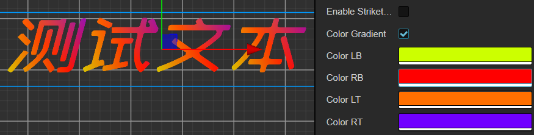
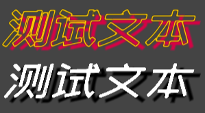

# Cocos TextMeshPro
一个用于Cocos Creator的文本渲染解决方案

## 目录
- [前言](#preface)
- [特性](#feature)
- [版本支持](#version)
- [如何使用](#how2use)
    - [插件](#plugin)
    - [组件](#component)
    - [API](#api)
    - [Example](#example)

## <a id="preface"></a>前言
用过Unity的应该知道，UGUI中的TextMeshPro功能强大，是一套极佳的文本渲染解决方案。此项目旨在为Cocos Creator提供类似的方案，以相对较低的代价，实现各种文本效果。由于需要重写渲染组件以及顶点数据填充，而Cocos Creator不同版本渲染实现差异较大无法兼容，故针对不同版本建了不同Git分支，使用前请切换对应的分支。

## <a id="feature"></a>特性
- 基于SDF进行文本渲染，无损放大
- 支持最多8张纹理的BMFont
    - 导出参数合理，以及项目多语言种类不多的情况下，可以将项目中所有文本全部导出在一个字体文件中
    - 一般来说，WebGL至少支持8个纹理单元，OpenGL至少支持16个纹理单元
- 支持颜色渐变
- 支持斜体
- 支持下划线、删除线
- 支持描边、镂空、阴影、辉光等特效
- 提供顶点数据接口，可以自由实现顶点动画
- 提供新的排版模式ELLIPSIS——当文本超出节点大小时，自动以"..."结尾

</br>

## <a id="version"></a>版本支持
目前经过测试的版本与系统如下，未列出的版本与系统仅表示暂未测试。

| Cocos Creator | [v2.4.9](https://github.com/LeeYip/cocos-text-mesh-pro/tree/v2.4.9) | [v3.6.0](https://github.com/LeeYip/cocos-text-mesh-pro/tree/v3.6.0) |
| :-: | :-: | :-: |
| Android | ✓ | X |
| Web | ✓ | ✓ |

- v2.4.9分支应该都可用于2.4.x系列版本，只不过2.4.5及以下版本中引擎源码材质hash值计算有bug，会导致某些情况下无法合批，请自行测试
- v3.6.0分支目前不支持低于3.6的版本，在3.6中引擎渲染实现有较大改动，故无法兼容

## <a id="how2use"></a>如何使用

#### <a id="plugin"></a>插件

</br>
插件中有两个选项，Font Tool为SDF字体生成工具。Import Assets为将TextMeshPro组件与材质等导入到assets目录下，若无法自动导入，请到插件目录下手动复制。（此仓库的项目assets中已包含这些文件无需再次导入）

</br>
Font Tool界面如上图所示
- Hiero路径：字体导出依赖工具，点击下载按钮会进入下载地址，需要确保已安装Java环境才能运行此工具
- 源字体：需要导出的ttf字体文件
- 导出目录：SDF字体导出目录
- 导出名称：导出的SDF字体文件名
- 导出文本：可选择导出输入框内的文本或者导出txt文件内的文本
- 字体参数：Font Size为字体导出大小，Padding为字体间距，这两个参数大一些会对渲染效果好一点，但过大可能会导致导出的纹理数量过多，注意不可超出纹理上限
- 纹理参数：导出的纹理大小
- SDF Scale：此参数越大对最终渲染效果越好，但过大会导致字体导出过于缓慢。原理是导出字体前先对所有字体进行此值的放大，然后再生成SDF纹理，再将字体缩小为导出的Font Size进行导出。
- Save：保存插件配置
- Export：导出字体，生成运行时所需的json和png。期间会用命令行自动打开Hiero工具，导出过程根据设置的参数可能会非常缓慢，请耐心等待Hiero自行关闭。

#### <a id="component"></a>组件

</br>
组件参数如上图所示
- Font：使用Font Tool导出的字体json文件
- Overflow：除了Cocos Creator Label组件的排版方式之外，还提供了新的排版模式ELLIPSIS。会自动计算文本大小，若超出节点大小，则以"..."结尾（**字体导出文本中必须包含字符"."**）

    </br>
- EnableItalic：斜体
- EnableUnderline：下划线，可调节高度（**字体导出文本中必须包含字符"_"**）
- EnableStrikethrough：删除线，可调节高度（**字体导出文本中必须包含字符"_"**）
- ColorGradient：颜色渐变开关，提供四个顶点的颜色设置，会和顶点颜色混合为最终的顶点颜色

    </br>
- TmpUniform：控制shader部分的参数，不同参数会影响TextMeshPro的合批
    - FaceColor：文本主体的颜色
    - FaceDilate：文本主体的粗细，范围0-1，0.5为标准值
    - FaceSoftness：文本主体的柔和度，越小字体显示越硬，越大则会让字体显示越虚

        </br>
    - EnableOutline：描边开关，配合FaceColor透明度可以实现文本镂空效果

        </br>
    - OutlineColor：描边颜色
    - OutlineThickness：描边厚度
    - EnableUnderlay：阴影开关

        </br>
    - UnderlayColor：阴影颜色
    - UnderlayOffset：阴影偏移，如x方向偏移一个像素则需填入的值为1/纹理宽度，y方向同理
    - UnderlayDilate：阴影厚度
    - UnderlaySoftness：阴影柔和度
    - EnableGlow：辉光开关，可以理解为在其他文本效果之上叠加一层描边，所以底下的颜色越暗效果越明显

        </br>
    - GlowColor：辉光颜色
    - GlowOffset：辉光偏移，范围0-1，0.5为标准值
    - GlowInner：辉光向内的厚度
    - GlowOuter：辉光向外的厚度
    - GlowPower：辉光强度，范围0-1，1为最强
- Textures：字体依赖的纹理

#### <a id="api"></a>API
- **`forceUpdateRenderData(): void`**  立即更新渲染数据
- **`setFont(font: cc.JsonAsset, textures: cc.Texture2D[]): void`**  动态设置字体
- **`isVisible(index: number): boolean`**  根据字符下标判断此字符是否可见
- **`setVisible(index: number, visible: boolean): void`**  根据字符下标设置字符是否可见
- **`getColorExtraVertices(index: number): [cc.Color, cc.Color, cc.Color, cc.Color] | null`**  根据字符下标获取颜色顶点数据，顺序为[左下, 右下, 左上, 右上]
- **`setColorExtraVertices(index: number, data: [cc.Color, cc.Color, cc.Color, cc.Color]): void`**  根据字符下标设置颜色顶点数据，会和节点颜色混合为最终的顶点颜色，顺序为[左下, 右下, 左上, 右上]
- **`getPosVertices(index: number): [cc.Vec2, cc.Vec2, cc.Vec2, cc.Vec2] | null`**  根据字符下标获取坐标顶点数据，顺序为[左下, 右下, 左上, 右上]
- **`setPosVertices(index: number, data: [cc.Vec2, cc.Vec2, cc.Vec2, cc.Vec2]): void`**  根据字符下标设置坐标顶点数据，顺序为[左下, 右下, 左上, 右上]

#### <a id="example"></a>Example
- 高效实现打字机效果：不必随时间每次都更新字符串，这样会导致每次更新字符串时顶点数据重新计算一次，浪费性能。

    </br>
    ```typescript
    // 更新文本后立即更新一次渲染数据，后续根据此渲染数据进行操作
    // 所有顶点动画效果都可参考此方式进行扩展
    this.text1.string = "这 是 一 段 测 试 文 字";
    this.text1.forceUpdateRenderData();
    // 先隐藏所有字符
    for (let i = 0; i < this.text1.string.length; i++) {
        this.text1.setVisible(i, false);
    }
    for (let i = 0; i < this.text1.string.length; i++) {
        // 逐个字符显示，并且过滤掉空格等不需要渲染的字符
        this.text1.setVisible(i, true);
        if (!this.text1.isVisible(i)) {
            continue;
        }
        await this.waitCmpt(this, 0.1);
    }
    ```
- 更多示例请参考仓库源码